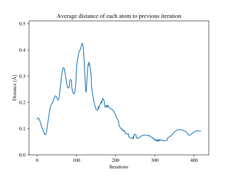
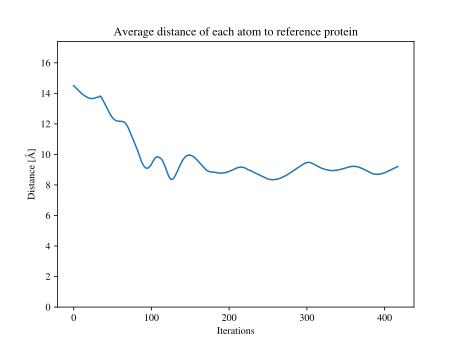

# Protein Folding
A fast and simple program for folding proteins. 

## Installation
The program requires Python, Pip, and Git.

```bash
git clone https://github.com/mes3n/protein-folding
cd protein-folding
```
To use a python virtual environment (virtualenv):
```bash
python -m venv my_venv
source my_venv/bin/activate
```
Then install dependencies with:
```bash
pip install -r requirements.txt
```

To finish, create a directory to store output:
```bash
mkdir out
```

## Dependencies
The program relies on biotite to load amino acids and chain them together (ref 1). Along with matplotlib in combinatination with biotite to graph the molecule.

## Run the Program
```bash
python bin/main.py
```
Set the number of iterations as the first argument when running the main script, default is 6:
```bash
python bin/main.py 6
```

Set the gui mode as the second argument when running the main script, default is 0 (only display molecule graph at the end of folding, 1 to display graph after each iteration, 2 to save graph to out after each iteration):
```bash
python bin/main.py 6 0
```

Constant weight variables can be used to scale to influence of different forces but are not recommended to modify. The step can be modified. 

## Results

Running with $step = 8 \cdot 10^{-8}$ produces the following results.



How much to protein moves after each iteration.



How close the protein matches the theoretical result (ref 2, molecules/1l2y.pdb)

## References
1. Kunzmann, P. & Hamacher, K. BMC Bioinformatics (2018) 19:346.
https://doi.org/10.1186/s12859-018-2367-z

2. Designing a 20-residue protein.
Neidigh, J.W., Fesinmeyer, R.M., Andersen, N.H. (2002) Nat Struct Biol 9: 425-430
