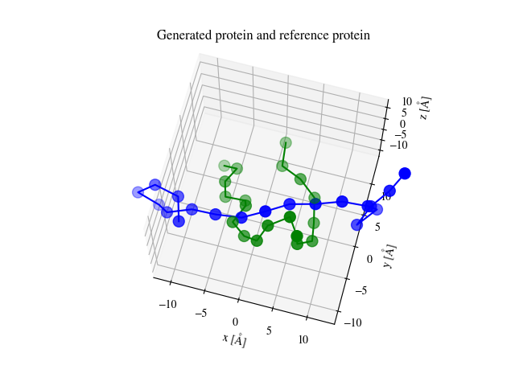
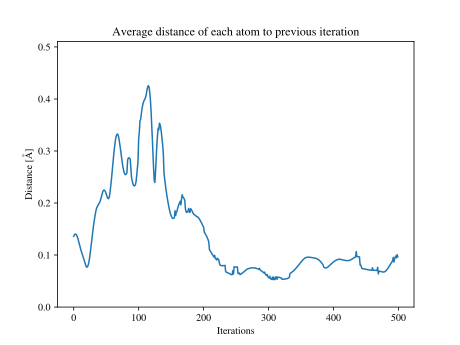
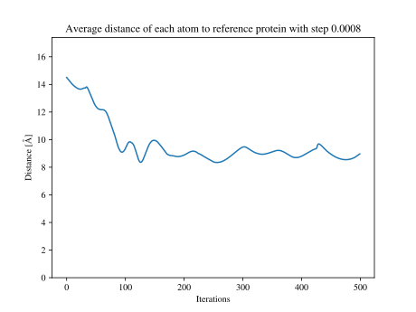
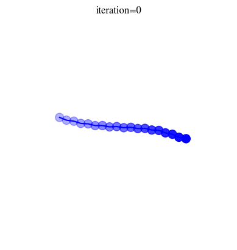

# Protein Folding
A fast and simple program for folding proteins. 

## Installation
The program requires Python, Pip, and Git.

```bash
git clone https://github.com/mes3n/protein-folding
cd protein-folding
```
To use a python virtual environment (virtualenv):
```bash
python -m venv my_venv
source my_venv/bin/activate
```
Then install dependencies with:
```bash
pip install -r requirements.txt
```

To finish, create a directory to store output:
```bash
mkdir out
```

## Dependencies
The program relies on biotite to load amino acids and chain them together (ref 1). Along with matplotlib in combinatination with biotite to graph the molecule.

## Run the Program
```bash
python bin/main.py
```

### Iteration count
Set the number of iterations as the first argument when running the main script, default is 6:
```bash
python bin/main.py 6
```

10 iterations currently takes 197.45 seconds.

### GUI mode
Set the gui mode as the second argument when running the main script, default is 0 (only display molecule graph at the end of folding, 1 to display graph after each iteration, 2 to save graph to out after each iteration):
```bash
python bin/main.py 6 0
```

### Controlling constants
Constant weight variables can be used to scale to influence of different forces but are not recommended to modify. The step can be modified either by editing directly in [bin/main.py](bin/main.py) or by running the program with a third argument, if no argument is giving the step constant will be used (8.0e-4):

```bash
python bin/main.py 6 0 8.0e-4
```

## Results

Running 500 iterations with $step = 8 \cdot 10^{-4}$ produces the following results.



The plot shows the generated protein model (green) and the reference model [2] (green) after being aligned through translation and rotation.



The figure illustrates the movement of the protein over 500 iterations. The y-axis is the distance each corresponding atom of the model moved following the previous iteration.



The figure depicts how well the generated protein model matches the reference model result [2]. The y-axis depicts the average distance of each corresponding atom in the reference and generative model.



The animation shows the different positions the generated model through the process of its folding. 

## References
1. Kunzmann, P. & Hamacher, K. BMC Bioinformatics (2018) 19:346.
https://doi.org/10.1186/s12859-018-2367-z

2. Designing a 20-residue protein.
Neidigh, J.W., Fesinmeyer, R.M., Andersen, N.H. (2002) Nat Struct Biol 9: 425-430. See file [here](molecules/1l2y.pdb).
